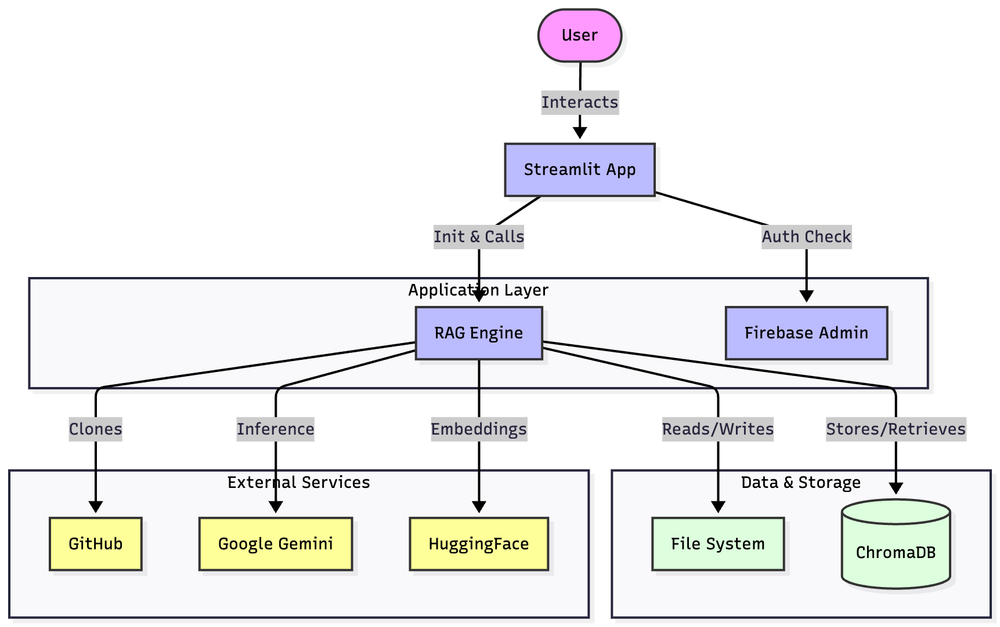
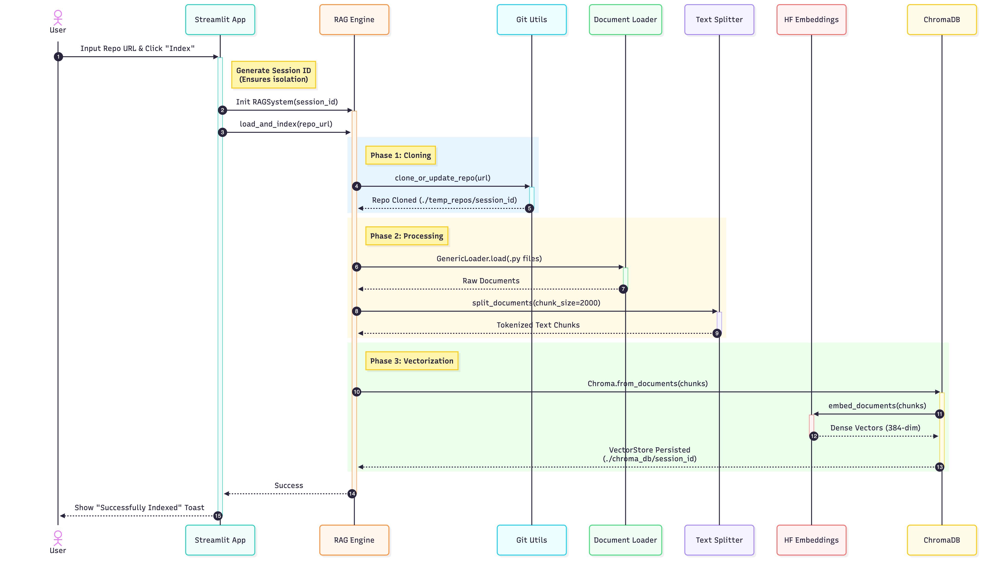
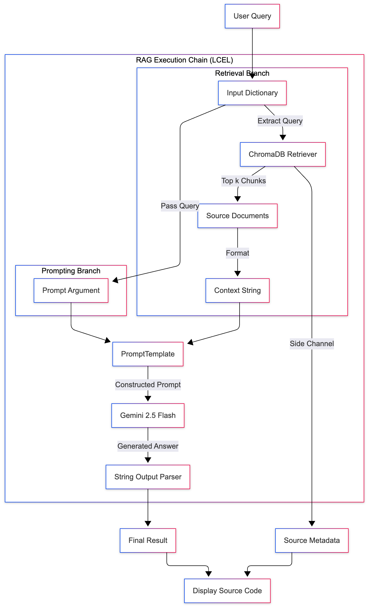

# _AI Codebase Archaeologist_ : Unearth the Architecture and Audit the Security of Any GitHub Repo

## Problem Statement: The Codebase Maze... : /

The initial stages of working on an unfamiliar, large, or legacy codebase are often a **time-sink** and a source of significant **technical debt**. Developers and auditors face the daunting task of:
1.  **Understanding high-level architecture** and data flow.
2.  **Locating critical functions** and entry points.
3.  **Identifying hidden security vulnerabilities** and anti-patterns.

Traditional search tools fall short, only finding keywords but failing to provide the **contextual and semantic understanding** required for meaningful code review.

**My Solution:** The **AI Codebase Archaeologist** transforms the entire codebase into a living, queryable knowledge base, allowing for instant, context-aware Q\&A and automated, expert-level security audits.

---

## Key Features & Value Proposition

This application leverages the power of **Retrieval-Augmented Generation (RAG)** to provide developers, auditors, and new team members with unprecedented access to codebase intelligence.

* **Code-Aware Q\&A:** Ask natural language questions like, *"Where is the main entry point for the Flask app?"* or *"How does the user authentication flow work?"*, and receive answers grounded **strictly in the actual source code**.
* **One-Click Code Audit:** A dedicated **"Run Full Code Review & Audit"** button triggers a specialized LLM prompt to perform comprehensive analysis for:
    * **Security Vulnerabilities** (e.g., SQL Injection, XSS).
    * **Refactoring Opportunities** (e.g., high complexity, duplicate code).
    * **Best Practice Violations**.
* **Strict Source Grounding:** Every answer is accompanied by the exact **code chunks** and their filenames that were used as context, ensuring **traceability and reducing LLM hallucinations**.
* **Ephemeral & Clean Architecture:** Uses unique session IDs and temporary directories (`temp_repos/{session_id}`) to ensure data isolation, cleanup, and a fresh environment for every repository indexed.

---

## Technology Stack

| Component | Technology | Purpose |
| :--- | :--- | :--- |
| **Frontend/App Framework** | **Streamlit** | Rapidly build the interactive web application and UI. |
| **Language Model (LLM)** | **Gemini 2.5 Flash** | Used for high-speed, expert-level text generation and code analysis. |
| **RAG/Orchestration** | **LangChain Expression Language (LCEL)** | Manages the end-to-end RAG pipeline (retrieval, prompt construction, generation). |
| **Vector Database** | **ChromaDB** | Stores vectorized code embeddings for efficient semantic search (local persistence for speed). |
| **Embeddings** | `sentence-transformers/all-MiniLM-L6-v2` | Converts code chunks into numerical vectors. |
| **Code Handling** | **GitPython**, `langchain_community` Loaders | Handles secure cloning of public GitHub repositories and filtering for Python files. |
| **Database (Optional)** | **Firebase/Firestore** | Supports deployment-scale use case for logging and authentication (currently set up for optional logging/auth context). |

---

## Architecture & Flow:

The system is built around the **Retrieval-Augmented Generation (RAG)** pattern, ensuring LLM answers are factual and specific to the codebase.

### 1. High-Level System Flow (End-to-End)


### 2. The Indexing Pipeline (`rag_engine.py`)

This process occurs upon clicking **"Clone & Index Codebase"**.

1.  **Clone:** The repository is cloned into a unique temporary directory (`./temp_repos/{session_id}`).
2.  **Load:** Only `.py` (Python) files are loaded and parsed.
3.  **Split:** The code is split into small, semantically meaningful chunks using a Python-specific `RecursiveCharacterTextSplitter`.
4.  **Embed:** Chunks are converted into numerical vectors using the `all-MiniLM-L6-v2` model.
5.  **Index:** Vectors are stored in the local **ChromaDB** vector store (`./chroma_db/{session_id}`).


### 3. The Query/Audit Pipeline (RAG Chain)

This process occurs upon asking a question or running the full audit.

1.  **Retrieve:** The user's query is also embedded and used to query the ChromaDB, retrieving the **Top K (3) most relevant code chunks (context)**.
2.  **Prompt Construction:** The retrieved code chunks are inserted into the `system_prompt` alongside the original user question.
3.  **Generate:** The complete prompt is sent to the **Gemini 2.5 Flash** model for a final, grounded answer.
4.  **Output:** The user receives the answer text and a detailed list of the source code snippets used.


---

## Getting Started

### Prerequisites

* Python 3.10 to 3.13 (Recommended: 3.13 for dependency compatibility)
* A **Gemini API Key** (required for the LLM).

### Installation

1.  **Clone the repository:**
    ```bash
    git clone https://github.com/saurabh1712/codebase_rag
    cd codebase_rag
    ```

2.  **Set up your environment:**
    Create a `.env` file in the root directory and add your key:
    ```env
    GOOGLE_API_KEY="YOUR_GEMINI_API_KEY_HERE"
    # Optional: other environment variables for Firebase, if needed.
    ```

3.  **Install dependencies:**
    ```bash
    pip install -r requirements.txt
    ```

### Running the App

1.  **Execute the Streamlit application:**
    ```bash
    streamlit run app.py
    ```
2.  The application will open in your browser (typically `http://localhost:8501`).

### Demonstration Workflow

1.  **Input:** In the application's input box, paste a public GitHub URL (e.g., `https://github.com/streamlit/streamlit-example`).
2.  **Index:** Click **"Clone & Index Codebase..."**. Wait for the `Yayy!!! Indexed...` success message.
3.  **Query:**
    * **Audit:** Click the **"Run Full Code Review & Audit"** button for a detailed report.
    * **Q&A:** Ask a question in the chat box, e.g., *"What function handles the main data processing?"*

---

## File Structure
```
├── app.py              # Main Streamlit application and UI logic.
├── rag_engine.py       # Core RAG implementation: Cloning, Indexing, LCEL chain setup, and Querying. 
├── utils.py            # Helper functions (e.g., git cloning). 
├── requirements.txt    # Python package dependencies. 
├── .env                # Environment variables (API Key). 
├── chroma_db/          # Stores vector embeddings for each repo based on session
├── assets/             # Contains architecture and flow of the application
└── temp_repos/         # Runtime folder for cloned repositories (cleaned on restart).
```

---

## High Level System Overview:


## Ingestion Pipeline Flow:


## Query & Audit Execution Flow:



## 👤 Maintainer

### **Saurabh Gujar** - [saurabhgujar17@gmail.com](mailto:saurabhgujar17@gmail.com) \| [LinkedIn](www.linkedin.com/in/saurabh-gujar)
  
  * Note: This project showcases expertise in new-age AI orchestration (LangChain, RAG) and robust application development (Streamlit, Firebase integration).*